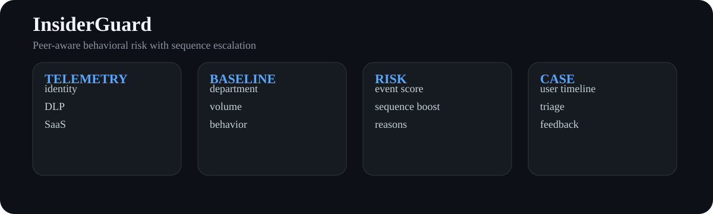
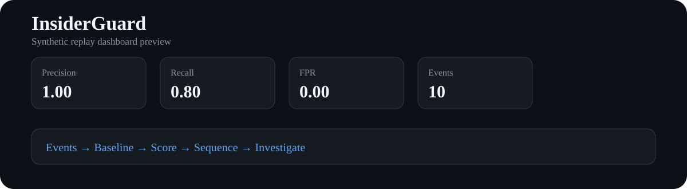

<div align="center">

# InsiderGuard

### Insider Threat · UEBA · DLP · Identity Risk · Data Exfiltration Detection

[](https://www.python.org/)
[](https://github.com/VinayK88/InsiderGuard/actions/workflows/tests.yml)


**identity + access + data movement → peer baseline → sequence risk → investigation timeline**

</div>

<p align="center"></p>
<p align="center"></p>

## Why this project exists

Insider-risk detection is difficult because many suspicious actions are individually legitimate. InsiderGuard treats the problem as **behavioral deviation plus sequence context** rather than a single-rule alert.

The system builds role/department peer baselines, scores data movement and identity events, boosts risk when suspicious events occur in meaningful sequences, and produces an analyst-readable timeline with explicit reasons.

## Signals

| Area | Examples |
| --- | --- |
| Identity | new country, MFA reset, privilege change, unusual application |
| Data movement | large downloads, external sharing, removable media, personal cloud |
| Temporal | after-hours activity, burst behavior, rapid multi-system access |
| Peer deviation | download volume and external-share counts relative to department peers |
| Sequence | privilege change → bulk download → external share / USB within a short window |

## Quick start

```bash
python -m venv .venv
source .venv/bin/activate
python -m pip install -e .
insiderguard --input sample_data/events.jsonl --output reports/baseline.json
python -m unittest discover -s tests -v
```

Optional dashboard:

```bash
python -m pip install streamlit
streamlit run dashboard/app.py
```

## Decision design

Risk is a transparent weighted sum of event severity, peer deviation, and sequence multipliers. A production system would calibrate thresholds against analyst capacity and explicit false-positive guardrails rather than optimizing raw recall alone.

## Repository map

```text
src/insiderguard/
├── models.py       normalized user activity event
├── baselines.py    department / peer behavioral baselines
├── detector.py     explainable event scoring
├── sequences.py    multi-event escalation patterns
├── evaluation.py   replay metrics
└── cli.py          deterministic replay and report
sample_data/        synthetic identity + DLP telemetry
reports/            checked-in baseline
assets/             architecture + dashboard preview
dashboard/          investigation timeline
tests/              baseline and sequence invariants
```

## Production evolution

High-value integrations include Entra/Okta identity logs, M365/Google Workspace, endpoint DLP, CASB, EDR, USB telemetry, HR role metadata with strict privacy controls, streaming feature windows, case-management dispositions, and drift monitoring by role/department.

> **Privacy boundary:** the checked-in activity is fully synthetic. Real insider-risk programs require purpose limitation, access control, minimization, and appropriate HR/legal governance.
