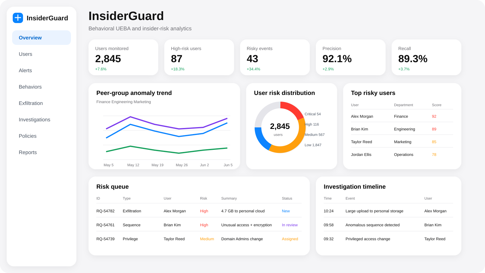
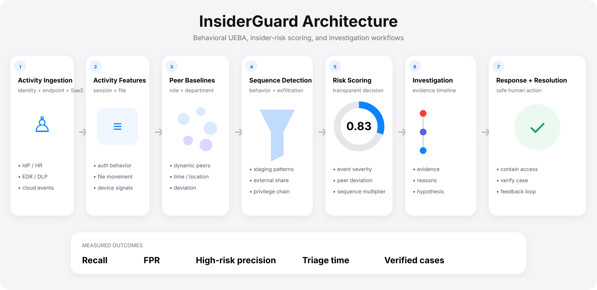

<div align="center">

# InsiderGuard

### Behavioral UEBA · Insider Risk · DLP · Exfiltration Detection

**Turn identity, access, peer deviation, and data movement into transparent insider-risk investigations instead of isolated alerts.**

[](https://www.python.org/)
[](https://github.com/VinayK88/InsiderGuard/actions/workflows/tests.yml)


`activity → peer baseline → sequence detection → risk → investigation → response`

</div>

<p align="center"></p>
<p align="center"><sub><b>Product visualization.</b> UI values are illustrative; measured public-replay metrics are reported below.</sub></p>

## The product idea

Insider-risk detection is difficult because many suspicious actions are **individually legitimate**. A large download, a privileged role change, an after-hours login, or an external share may each be explainable on their own. InsiderGuard treats risk as the combination of **behavioral deviation + identity context + meaningful event sequences**.

<table>
<tr>
<td width="25%" valign="top"><b>01 · Baseline</b><br/><sub>Department and peer behavior establish an expected operating range instead of one global threshold.</sub></td>
<td width="25%" valign="top"><b>02 · Sequence</b><br/><sub>Privilege change → download → external share becomes more meaningful than three disconnected alerts.</sub></td>
<td width="25%" valign="top"><b>03 · Explain</b><br/><sub>Risk scores retain the reasons that drove them so an analyst can audit the decision.</sub></td>
<td width="25%" valign="top"><b>04 · Investigate</b><br/><sub>User-level risk and an ordered event timeline create a compact investigation surface.</sub></td>
</tr>
</table>

## Architecture

<p align="center"></p>

The public implementation uses transparent event weights, peer baselines and sequence multipliers. A production version should calibrate risk against analyst capacity, explicit false-positive guardrails, privacy controls, and role/department drift.

## Measured synthetic replay

The deterministic fixture contains ten synthetic identity / DLP events across seven users.

| Metric | Result |
| --- | ---: |
| Events | **10** |
| Users | **7** |
| True positives | **4** |
| False positives | **0** |
| Precision | **1.00** |
| Recall | **0.80** |
| False-positive rate | **0.00** |
| High-risk users at threshold | **2** |

> These values demonstrate the replay, scoring and evaluation mechanics on the included synthetic fixture. They are not production insider-risk efficacy claims.

## Signals

| Area | Examples |
| --- | --- |
| Identity | new country, privilege context, unusual login |
| Data movement | bulk download, cloud upload, external sharing |
| Temporal | after-hours activity and burst sequences |
| Peer deviation | activity compared with role / department peers |
| Sequence | privilege change → download → external share |

## 60-second reviewer path

1. **Review the product dashboard and architecture above.**
2. Open [`src/insiderguard/baselines.py`](src/insiderguard/baselines.py) for peer-group behavior.
3. Open [`src/insiderguard/detector.py`](src/insiderguard/detector.py) for explainable event scoring.
4. Open [`src/insiderguard/sequences.py`](src/insiderguard/sequences.py) for multi-event escalation patterns.
5. Inspect [`reports/baseline.json`](reports/baseline.json) and launch the investigation dashboard.

## Run it

```bash
python -m venv .venv
source .venv/bin/activate
python -m pip install -e .
insiderguard --input sample_data/events.jsonl --output reports/baseline.json
python -m unittest discover -s tests -v
```

### Product dashboard

```bash
python -m pip install streamlit
streamlit run dashboard/app.py
```

The dashboard includes peer-group trend views, user-risk distribution, top-risk users, risk queue, investigation timeline, and peer-baseline drill-down.

## Repository map

```text
src/insiderguard/
├── models.py       normalized activity event
├── baselines.py    department / peer behavioral baselines
├── detector.py     explainable event scoring
├── sequences.py    multi-event escalation patterns
├── evaluation.py   replay metrics
└── cli.py          deterministic replay and report
sample_data/        synthetic identity + DLP telemetry
reports/            checked-in measured baseline
assets/             product + architecture visuals
dashboard/          product-style investigation surface
tests/              baseline + sequence invariants
```

## Production evolution

High-value integrations include Entra / Okta identity logs, Microsoft 365 / Google Workspace, endpoint DLP, CASB, EDR, USB telemetry and HR role metadata under strict privacy controls; plus streaming feature windows, case dispositions and drift monitoring by role and department.

> **Privacy boundary:** all checked-in activity is synthetic. Real insider-risk programs require purpose limitation, data minimization, access controls, and appropriate HR/legal governance.
